# myhttpframework
简易的http框架

计算机网络前置知识：

互联网的发展是多种因素共同作用的结果：
1.早期的计算机体积大，价格昂贵，资源有限 后来由于集成电路的发展，使得计算机体积变小，价格降低，性能提升 
再加上后面的芯片的出现，使得计算机民用变得可能
2.信息传输的发展，怎么解决的数据传输的问题？
分布式可适应信息块交换集成电路的出现
风暴交换算法的提出：解决数据如何从一个点通过一个复杂的网络到达另外一个点的问题
3.材料的发展 同轴电缆（早期的电话线、闭路线）、双绞线电缆（速度快，五类网线、六类网线）、光纤（较少衰减）
4.操作系统的进步，操作系统能够跑多个应用等技术进步

互联网发展历史：
1/1969出现了阿帕网（美国国防部高级研究计划局）ARPANET 今天互联网雏形，连接四个节点 传输速率低，无应用场景

需要解决的问题：
1.应用程序的依赖性
2.互联网的地址
3.传输以及研发的成本：传输的正确性（TCP）
4.带宽：解决传输速率比较慢的问题
5.网络安全：明文传输速率
6.标准进化：互联网兼容性差；出现OSI七层模型解决问题
7.商业力量的介入

万维网：第一个的浏览器万维网

多种因素共同作用构建今天的互联网的繁荣

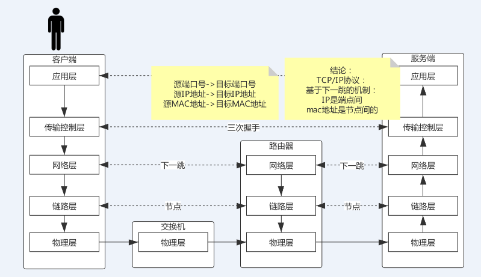

经典OSI七层模型（开放式系统互联模型，世界上第一个试图在世界范围内规范网络标准的框架）：
在这个模型之前，学术界已经成型了，需要解决的问题如封包交换原理、数据传输能力等

应用层   --》 表现层  --》会话层 ==》 传输层  ==》网络层  ==》数据链路层  =》物理层

简单描述下每层要做的事情：

应用层：模型最上方，只关心业务逻辑，不关心数据传输

表现层：协商数据传输格式，并转换数据格式
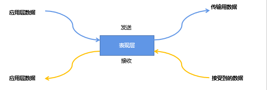

传输层：负责将的数据从一个实体（一个服务或者应用）传输到另外一个实体，但是不负责数据传输的方式

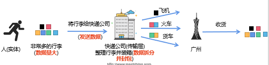

传输层的能力：
1.数据分隔重组：将数据出拆分后按顺序重组
2.纠错：在数据传输过程中出现问题才去方式进行纠正
3.管理连接：处理数据的频繁交换
4.流量控制：控制传输数据的速率
5.端口寻址：标明参与参数的实体的端口号

网络层：负责将数据从一个节点传输到另外一个节点（把一个封包从一个ip地址传输到另一个ip地址）

一个节点接收到一个封包之后，他是怎么把这个封包传递到下个节点？
路由算法（下一跳机制，后面会有详细的讲解）

数据链路层：
1.确保两个临近设备之间进行数据的传输，并隐藏底层实现
2.帧同步：两个设备之间传输时的协商速率问题
3.数据纠错

物理层：封装和隐藏具体的传输手段，并提供稳定的传输接口
比如：电缆、光纤、蓝牙等
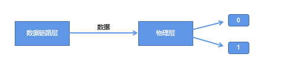

OSI的问题：
1.分层臃肿，并非每一层都是必要的
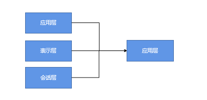

我们来分析一下上面这张图，看看能够对于我们理解OSI是否有一点启发
我们来ping一下百度，看看会发生什么
1.本机与百度之间是否会发生TCP连接
不会发生TCP连接
ping是一种网络诊断工具，判断的是网络联通性，用于测试主机之间连通性
通过发送ICMP协议的回显请求报文，来判断网络是否连通
这是一个网络层协议
2.本机与百度之前是不是约定了数据传输的格式、是否需要压缩等
并没有约定数据传输的格式
3.本机与百度之间假设发生了TCP连接，本机与百度之间的连接会话是否需要保持？
两者之间没有产生会话，也不需要进行会话的保持

实际工程上，OSI也没有实际可行的方案

因此后续TCP/TCP进行了蓬勃发展的时代

TCP/IP协议群需要解决的问题：
1.报文拆分
数据量大，网络底层设备不支持
拆分成多个块，复用路径
2.增加协议头
数据分块之后在接收端需要重组，所以需要使用头部来添加一些描述字段

3.数据在相邻设备之间数据传输
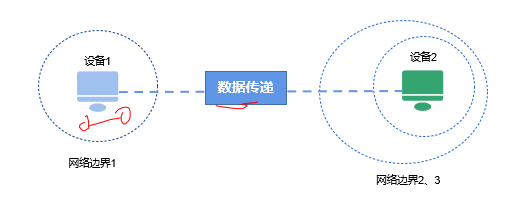

4.路由与寻址
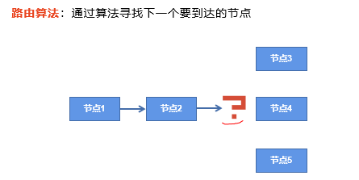

5.数据重组
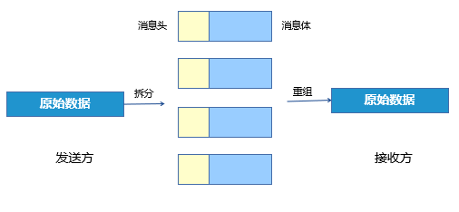

再次回过头来看看TCP/IP的五层架构

每层的分工：
1.应用层
数据从一个应用到另外一个应用的过程=
2.传输控制层
主机到主机之间的数据传输
3.网络层
提供路由与寻址
4.数据链路层
两个节点之间的物理连接
5.物理层
负责0-1信号的传输（计算机世界中表示数据都是二进制）

TCP/IP对比OSI：
1.删除了会话层，会话是虚拟概念，不是必须的
2.删除了表示层，数据压缩、数据格式转换不是必须的

TCP/IP协议群可选性：
1.传输层：TCP协议、UDP协议、TLS协议SSL协议 SCTP协议
2.网络层：IP协议、ICMP协议、IGMP协议

TCP：特点  Transport Control Protocol
1.可靠性 数据保证无损传输
（1）使得无序数据恢复原有顺序
（2）多播时每个接收方都能获得无损副本
2.全双工
3.连接到导向

TCP三次握手：

第一次： 客户端发送一个SYN包（同步序列编号）到服务器，进入SYN_SEND状态，等待服务器确认

第二次：服务器收到SYN包，必须确认客户的SYN（发送一个ACK），同时自己也发送一个SYN包，即SYN+ACK包，此时服务器进入SYN_RECV状态

第三次：客户端收到服务器的SYN+ACK包，向服务器发送确认包ACK，发送完毕后，客户端和服务器进入ESTABLISHED（已连接）状态，完成三次握手

四次挥手：

第一次：客户端发送一个FIN包，表示客户端没有数据发送了，但是可以接收数据
第二次：服务器收到这个FIN包，发回一个ACK包，表示服务器端知道客户端没有数据发送了
第三次：服务器端发送一个FIN包，表示服务器端没有数据发送了
第四次：客户端收到这个FIN包，发回一个ACK包，表示客户端知道服务器端没有数据发送了

TCP通信流程：

通信的过程：

我们先看个例子：
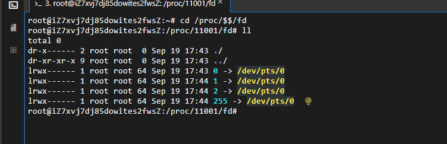

在本机执行 cd /proc/$$/fd  这是linux文件系统的一部分，用于表示当前进程的文件描述符
1.$$ 在shell中 是一个特殊的变量 表示当前shell进程的 进程ID  pid

/proc/<pid>/fd是linux的proc文件系统的一个目录，用于列出指定进程PID打开的所有文件描述符

/proc/<pid>/fd 中的每个文件名是一个数字，表示文件描述符的编号
0：标准输入
1：标准输出
2.标准错误
其他数字：表示进程打开的其他文件或者资源

2.exec 8<> /dev/tcp/www.baidu.com/80
echo -e 'GET / HTTP/1.1\n' >& 8
cat <&8

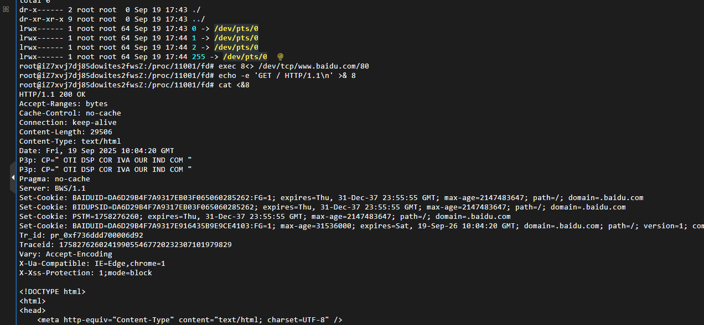

1. exec 8<> /dev/tcp/www.baidu.com/80

使用一个exec命令 打开一个文件描述符8，并将其与TCP连接到www.baidu.com的80端口进行双向通信
/dev/tcp是bash的特殊的文件系统 用于通过tcp协议建立网络连接
www.baidu.com是目标主机的域名
80是目标主机的端口号
2. echo -e 'GET / HTTP/1.1\n' >& 8
使用echo命令 发送一个HTTP GET请求到文件描述符8所代表的TCP连接
3. cat <&8
使用cat命令 从文件描述符8所代表的TCP连接中读取响应数据，并输出到标准输出
4. 关闭文件描述符8
exec 8>&- 关闭文件描述符8，结束与服务器的通信

三次握手 + 数据传输 + 四次挥手 成为一个最小力度 不可被分割的单元

网络层：下一跳机制
路由表：route -n
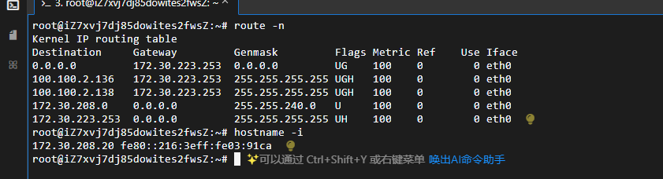
路由表的字段含义：
1.Destination 目标网络地址 当它为default时，表示默认网关(0.0.0.0) 所有的数据都发到这个网关
2.gateway 网关地址 0.0.0.0表示当前记录对应的Destination跟本机在同一个网段 通信时不需要经过网关

arp -n

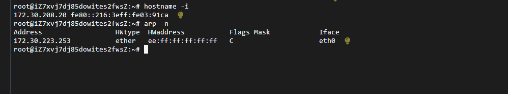

arp协议 是一种协议或者程序 用于将不断变化的互联网协议地址链接到局域网中的固定物理机器地址 也称为媒体访问控制层

IP协议是端点与端点之间的通信（host to host）
TCP协议是应用与应用之间的通信（process to process）
arp协议是局域网内的通信（node to node）节点之间的通信

我们来看看整个过程：
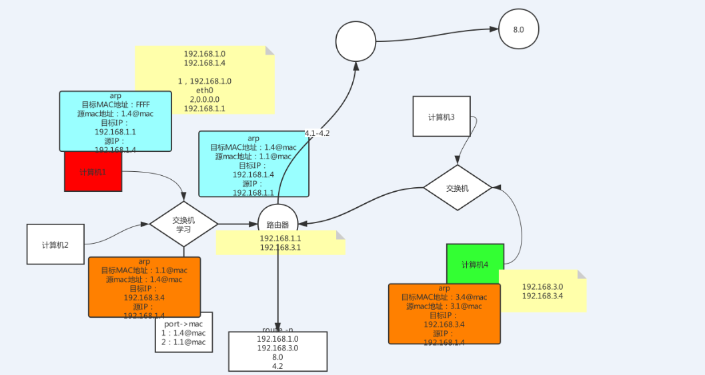

计算机1 假定ip地址：192.168.1.4
路由器网关的ip地址192.168.1.1 另外一个网卡的IP是192.168.3.1

计算机4的ip地址是：192.168.3.4

现在计算机1想与计算机4通信是个什么过程

1.计算机1与计算机4不在同一个网段 需要经过路由器进行转发

计算机4的ip与计算机1的子网掩码进行按位与运算 找到下一跳 就是路由器192.168.1.1的这个默认网关

路由器也存在路由表 通过路由器的下一跳找到路由器的另外一个网卡的子网

为什么需要网络链路层中的mac地址？
首先要明确一个概念，下一跳是个什么概念 计算机1相与计算机4进行通信，必须要经过路由器的转发
也就是经过子网掩码按位与运算之后得到默认网关，但是这只是找到了下一跳，数据包最终能够找到192.168.3.4这个机器吗？
是不行的，我们一开始的通信就是192.168.1.4想与192.168.3.4进行通信，ip地址之间的通信是端点与端点之间的通信，目标IP地址
是192.168.3.4，并不是默认网关192.168.1.1 这个默认网关的IP地址并不是最终要进行通信的目标地址，数据包到达网关之后，需要网关进行
转发，再通过网关找到下一跳，因此需要在节点之间进行转发，最终实现端点与端点之间的通信

继续上面的图的分析：已经通过子网掩码找到了下一跳，但是还不能实现端点与端点之间的通信问题，因此还需要数据的链路层的努力
那么计算机1是怎么知道网关的mac地址的存在呢？
arp协议的出现就是为了解决这个问题？
arp的核心作用
1.IP与MAC地址映射 将逻辑IP地址转换为物理mac地址
2.数据包的正确发送：在局域网中，数据包的传输最终需要依赖MAC地址来定位接受方，ARP协议确保设备能够获取目标设备的MAC地址
从而构建出正确的数据帧并将其发送到正确的设备上

工作原理：
1.ARP请求：当一台主机的需要发送数据到另外一个IP地址时，它会先检查本地的RAP缓存表看是否已经有目标IP地址对应的MAC地址
2.广播查询：如果RAP缓存表没有 该主机就会向局域网内的所有设备广播一个ARP请求包 其中包含目标IP地址
3.ARP响应：收到ARP请求包的设备会检查包中的目标IP地址，如果该地址是自己的IP地址 它就会响应一个ARP响应包 包含自己的MAC地址
发送给请求主机
4.ARP缓存更新：请求主机接收到ARP响应后，就会将其中的IP地址和MAC地址对应关系添加到自己的ARP缓存表中 并使用这个MAC地址来发送数据

刚开机的时候arp -a 关于ip到mac地址映射是没有，所以这时候先做一件事，单独去发一个数据包，这个数据包也叫arp的数据包 但是这时候还没有IP到MAC地址
的映射（世界上是先有的鸡还是先有的蛋呢？） 如果想发一个arp的包 但是没有关于IP到MAC的地址映射 数据包又必须有源IP地址与目标IP地址，初始化的时候的ARP
协议很特殊，这个MAC地址是全FF的，交换机会有特殊的约束，如果遇到全F的MAC地址，这个包会被广播，广播除这个入口之外的所有机器，其他的机器不是目标机器，会
丢弃这个数据包，如果路由器发现目标地址就是我的地址，就会响应这个数据包，把自己的MAC地址的包发送出去，那么这个数据包就会发送到交换机，交换机有个能力（二层交换机）
学习能力，学习port+mac的学习，记录端口号好mac的映射，包刚来的时候，待着一个端口号以及一个mac地址，接收到看路由器的回包之后，交换机已经有了mac地址到port的
映射，就会定点转发，返回到初始化的源计算机

在不同模型中的位置：
OSI模型：ARP协议通常被视为工作在数据链路层
TCP/IP模型：ARP协议被视为网络接口层的一部分，因为他为IP协议提供地址解析服务 尽管如此 它仍然是在数据链路层进行实际封装和传输的

